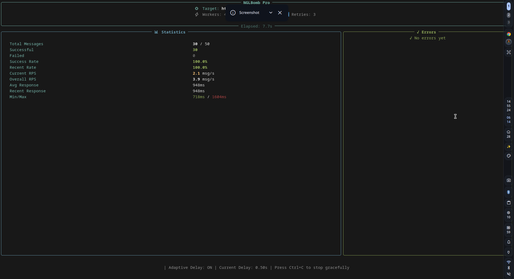
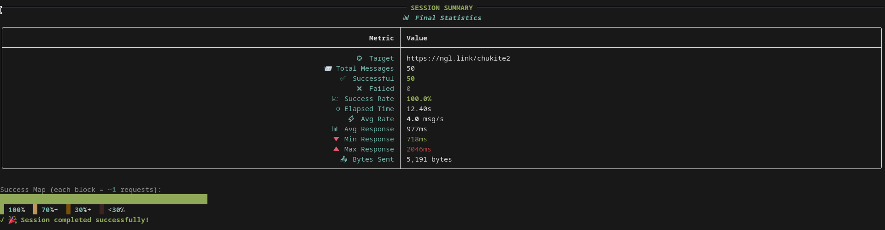
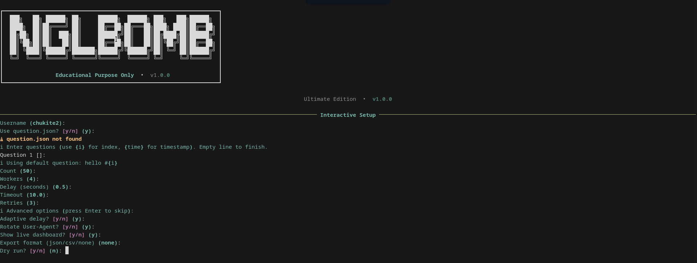

# NGLBomb

<p align="center">
  
  
  
  
</p>

<p align="center">
  <strong>A premium terminal experience with live dashboards, real-time charts, animated progress, and comprehensive session analytics.</strong>
</p>

---

> **⚠️ EDUCATIONAL PURPOSE ONLY**
>
> This script is provided **strictly for educational and research purposes only**. It is intended to demonstrate:
> - HTTP request automation and threading patterns in Python
> - Building rich terminal UIs with the `rich` library
> - Connection pooling, retry logic, and adaptive rate-limiting strategies
> - Session analytics, data export, and CLI dashboard design
>
> **Misuse of this tool to harass, spam, or abuse any individual or service is illegal and unethical.** The author does not condone nor support any malicious use. By using this software, you agree to take full responsibility for your actions.
>
> If you are the owner of content affected by this tool and wish to have it removed or discuss takedown, please contact: **chukite@chukite.me**

---

## Screenshots

### Live Dashboard (Real-time Execution)
<p align="center">
  
</p>

### Session Summary & Analytics
<p align="center">
  
</p>

### Interactive Setup & Configuration Tree
<p align="center">
  
</p>

---

## Features

- **Live Dashboard** — Real-time statistics, error tracking, RPS monitoring, and visual success maps
- **Rich Terminal UI** — Powered by [Textualize/Rich](https://github.com/Textualize/rich) for beautiful tables, panels, progress bars, and trees
- **Thread Pool Executor** — Configurable worker count for concurrent request handling
- **Adaptive Delay** — Automatically adjusts request timing based on response latency and error rates
- **Retry Logic** — Exponential backoff with jitter for failed requests
- **User-Agent Rotation** — Cycles through realistic browser UAs to avoid detection
- **Proxy Support** — Single proxy or proxy list from file
- **Session Export** — Export full results to JSON or CSV with metadata
- **Dry Run Mode** — Simulate execution without sending actual requests
- **Graceful Shutdown** — Press `Ctrl+C` to stop cleanly without losing data
- **Connection Pooling** — Reuses HTTP connections for improved performance
- **Interactive Config** — Step-by-step wizard when no CLI args are provided

---

## Requirements

- Python **3.8+**
- `rich` library (optional but strongly recommended for the premium UI)

---

## Setup

### 1. Clone the Repository

```bash
git clone https://github.com/yourusername/nglbomb-pro.git
cd nglbomb-pro
```

### 2. Install Dependencies

```bash
# Install rich for the full premium UI experience
pip install rich

# Or install from requirements
pip install -r requirements.txt
```

> **Note:** The script will still run without `rich`, but will fall back to a plain text interface.

### 3. Prepare Questions (Optional)

Create a `question.json` file in the project root:

```json
[
  "Hey! What's up? #{i}",
  "Random question #{i} at {time}",
  "Just testing something...",
  "Message number {i}",
  "Hello from the other side #{i}"
]
```

- Use `{i}` as a placeholder for the message index.
- Use `{time}` as a placeholder for the current timestamp.

If `question.json` is not found, the script will prompt you to enter questions manually or use a default.

---

## Usage

### Interactive Mode (Recommended for First Use)

Simply run the script without arguments to launch the interactive setup wizard:

```bash
python nglbomb.py
```

You will be guided through:
- Target username
- Question source (`question.json` or manual input)
- Message count, workers, delay, timeout, retries
- Advanced options (adaptive delay, UA rotation, dashboard, export)

### Quick CLI Mode

```bash
# Send 50 messages to a user
python nglbomb.py -u john -c 50

# Fast mode with 8 workers and low delay
python nglbomb.py -u john -c 100 -w 8 -d 0.1

# Dry run (simulate without sending)
python nglbomb.py -u john -c 10 --dry-run

# Export results to JSON
python nglbomb.py -u john -c 50 -e json -o results.json

# Use a proxy
python nglbomb.py -u john -c 50 --proxy http://proxy:8080

# Use a proxy list from file
python nglbomb.py -u john -c 100 --proxy-file proxies.txt

# Disable live dashboard (plain progress bar)
python nglbomb.py -u john -c 50 --no-dashboard

# Custom questions inline
python nglbomb.py -u john -c 20 -q "Hello!" "How are you?" "What's new?"

# Custom questions from file
python nglbomb.py -u john -c 50 -f my_questions.json
```

### CLI Arguments Reference

| Flag | Description | Default |
|------|-------------|---------|
| `-u, --username` | Target NGL username | *(interactive)* |
| `-c, --count` | Number of messages to send | `10` |
| `-w, --workers` | Thread pool workers | `4` |
| `-d, --delay` | Base delay between requests (seconds) | `0.5` |
| `-t, --timeout` | Request timeout (seconds) | `10.0` |
| `-r, --retries` | Max retries per request | `3` |
| `-q, --questions` | Inline questions (space-separated) | — |
| `-f, --question-file` | JSON file with questions array | `question.json` |
| `--dry-run` | Simulate without sending requests | `False` |
| `-e, --export` | Export format: `json` or `csv` | — |
| `-o, --output` | Export file path | — |
| `--no-adaptive` | Disable adaptive delay | `False` |
| `--no-rotate-ua` | Disable User-Agent rotation | `False` |
| `--no-dashboard` | Disable live dashboard | `False` |
| `--proxy` | Single proxy URL | — |
| `--proxy-file` | File with proxy list (one per line) | — |
| `-v, --verbose` | Verbose output | `False` |
| `--endpoint` | Custom API endpoint | `https://ngl.link/api/submit` |

---

## Configuration File

The script automatically saves your last interactive configuration to:

```
~/.nglbomb/config.json
```

This allows quick re-runs without re-entering all settings. You can delete this file to reset.

---

## Export Formats

### JSON Export

```json
{
  "meta": {
    "tool": "NGLBomb Pro",
    "version": "2.0.0",
    "timestamp": "2026-06-14T14:20:00"
  },
  "config": { ... },
  "stats": { ... },
  "results": [
    {
      "index": 1,
      "ok": true,
      "status": 200,
      "error": null,
      "duration_ms": 245,
      "attempts": 1,
      "timestamp": "...",
      "proxy": null,
      "user_agent": "..."
    }
  ]
}
```

### CSV Export

| index | ok | status | error | duration_ms | attempts | timestamp | proxy | user_agent |
|-------|----|--------|-------|-------------|----------|-------------|-------|------------|
| 1 | True | 200 | | 245 | 1 | ... | | ... |

---

## How It Works

1. **Configuration** — Parses CLI args or launches interactive wizard.
2. **Payload Generation** — Builds form-encoded payloads with randomized `deviceId`.
3. **Request Dispatch** — Uses `ThreadPoolExecutor` to send concurrent POST requests.
4. **Response Handling** — Categorizes HTTP errors (429, 403, 500, timeouts, etc.).
5. **Adaptive Delay** — Adjusts sleep time based on latency and error patterns.
6. **Live Dashboard** — Refreshes a Rich `Layout` with real-time stats every few completions.
7. **Session Summary** — Prints final statistics, error breakdown, recent failures, and a sparkline.
8. **Export** — Optionally writes structured results to JSON/CSV.

---

## Safety & Rate Limiting

- **Adaptive delay** increases wait time when rate limits (HTTP 429) or timeouts are detected.
- **Exponential backoff** with random jitter prevents thundering-herd retries.
- **User-Agent rotation** helps distribute request fingerprints.
- **Connection pooling** reduces overhead and avoids excessive TCP handshakes.

---

## Disclaimer

This tool is a **proof-of-concept** for educational use in studying:
- Python concurrency (`concurrent.futures`, `threading`)
- Terminal UI design (`rich` library patterns)
- HTTP client engineering (`urllib`, headers, pooling)
- Resilient request strategies (retries, backoff, jitter)

**The author is not responsible for any misuse.** Respect the Terms of Service of any platform you interact with. Do not use this tool to spam, harass, or abuse others.

---

## Contact & Takedown

If you have concerns about this repository or need to request removal of content, please reach out:

📧 **chukite@chukite.me**

---

## License

MIT License — See [LICENSE](LICENSE) for details.

---

<p align="center">
  <sub>Built with Python & Rich. For educational purposes only.</sub>
</p>
